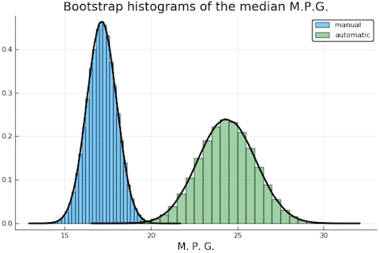
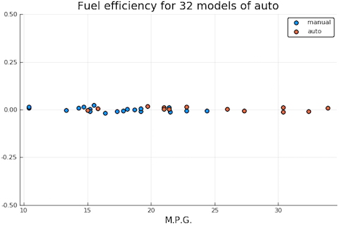
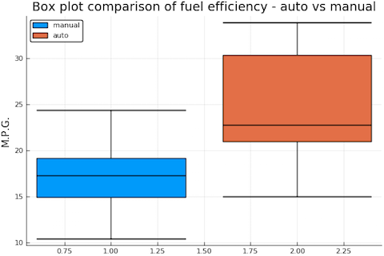
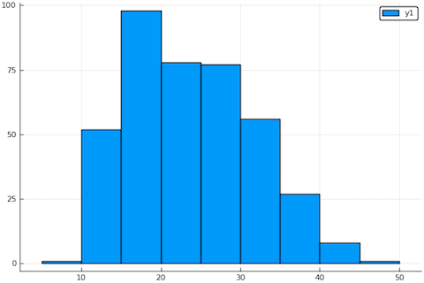

# Are automatic cars more fuel efficient?

Anthony Blaom, July 2018

## The brief

Given a table of characteristics for 32 automobiles, investigate
whether or not the transmission type influences an automobile's fuel
efficiency.

## Conclusions (executive summary)

A qualitative and quantitative statistical analysis of the data
provided suggests that automatic cars have better fuel economy than
cars with a manual transmission. These conclusions are drawn under the
assumption that the supplied data is a fair representation of cars
more generally (no sampling bias) and under additional technical
assumptions of a mild nature.


## Analysis 

For details of the following analysis, see the Julia notebook in the Appendix.

1. As the problem here is fairly well-formulated, further
   consultation with the client was not deemed necessary. 

2. *Identify relevant variables.* The supplied data already includes the
   fuel efficiency of cars in miles per gallon, denoted `mpg` below, and
   the transmission type of each car, automatic or manual, denoted
   `am`. It was difficult to see how the other characteristics could add
   further information and they were consequently ignored.

3. The "target" variable `mpg` is continuous and the "independent"
   variable `ac` is boolean. There are several very
   well-known statistical methods to determine whether a boolean variable
   effects a continuous one, and we should expect to
   either: (i) decide that indeed transmission type effects fuel
   efficiency, or (ii) be unable to decide if transmission type
   effects fuel efficiency without acquiring more data.
   
4. *Preliminary qualitative analysis.* Proceeding along standard lines, I
   split the `mpg` samples into two samples, one for manual cars and
   one for the automatic cars. These are roughly balanced samples
   (sized 19 and 13 respectively) but of relatively small size. To get
   a rough feel for the data I do a labeled [jitter
   plot](figures/plt1.png) and a [box plot](figures/plt2.png) (which
   reveals that the median fuel efficiency is higher in the automatic
   sample). To get a quick qualitative insight into the question at
   hand, I construct 100,000 bootstrap samples from each sample and
   plot histograms of the bootstrap medians:

   
   
   The clear separation of the two histograms suggests to me that
   automatic cars indeed have better fuel efficiency.

5. I decide to apply two standard quantitative methods: (i) Bootstrap
   confidence interval for the difference in medians of the underlying
   pdfs; and (ii) Welch t-test for the null hypothesis "The underlying
   pdfs of both samples have the same median". The advantage of method
   (i) is that I don't need to make assumptions about the underlying
   probability distributions; the disadvantage is that it is only
   asymptotically exact (and our sample sizes are small). The
   advantage of (ii) is that is an exact test, but it assumes the
   underlying pdfs are normally distributed.
   
6. *Bootstrap confidence intervals.* I construct pivotal and
   percentile 95% confidence intervals for the difference of the
   medians, using a simulation size of 100,000. These intervals are:
   
   interval type | left value | right value
   --------------|------------|------------
   pivotal       | 4.6        | 5.1
   percentile    | 5.9        | 6.4

   As zero lies well outside both intervals, this suggests that
   automatic cars are more efficient than manual cars. However, as the
   sample size is small, I shall look to my second method for
   confirmation.

7. *t-test.* For it to be an exact test, the two-sample Welch t-test
   requires that we assume the underlying pdfs are normal, although it
   has been empirically observed that the test is somewhat robust to
   deviations to normality. In fact strictly positive-valued
   continuous data cannot be perfectly normal and previous experience
   suggests the data will be skewed and that a log transformation
   would probably make the data more normal. However, with such a
   small sample size, it is not possible to determine with any
   confidence whether this is really the case.  
   
   To settle the issue, we decided to search for larger but similar data
   elsewhere and in fact found fuel efficiency data for for about
   400 automobiles
   [elsewhere](https://github.com/RodolfoViana/exploratory-data-analysis-dataset-cars).
   In this case we found that a log transformation indeed improved
   normality. Although probably overkill for this problem, we went on
   to find the Box-Cox transformation optimizing a normality measure
   (Box-Cox transformations generalize log transformations) and this
   is the transformation we applied to our data before performing the
   t-test. 
   
   Applying Welch's two-sample t-test (to the supplied data,
   transformed) we obtained a p-value of about 0.0008, which is strong
   evidence to reject the null-hypothesis. In plainer language: **If
   transmission type makes *no* difference to fuel efficiency, then
   the probability that we could have obtained the sample observed, or
   a more extreme sample, is about 1 in 1000.**
   
   
8. Despite the technical assumptions necessary to make our analysis,
   the clear conclusion of both methods is the same: **Automatic cars
   are more efficient than manual ones.**
   
*Technical note:* The t-test applies to *means* not *medians*; however
our transformations map the median to the transform of the median, and
for normal distributions the two notions coincide.


## Appendix. Julia notebook for computations and plots

In this project I used Julia for the analysis, together with some
standard stats/ML libraries and my own ML library `Koala`. In the past
I have generally used Python.


### Load libraries and get data
       
````julia 
julia> using Koala # Author's stats/ML environment 
julia> using KoalaTransforms 
julia> import KoalaTransforms.normality 
julia> using DataFrames 
julia> using CSV 
julia> using StatsBase 
julia> using HypothesisTests 
julia> using Plots 
julia> using StatPlots 
julia> pyplot() # use python plotting backend Plots.PyPlotBackend()

julia> cars = CSV.read("data/cars_data.csv");
````

### Initial look at data
       
Dump irrelevant features:

````julia
julia> cars = cars[[:am, :mpg]];
julia> head(cars)
6×2 DataFrames.DataFrame
│ Row │ am │ mpg  │
├─────┼────┼──────┤
│ 1   │ 1  │ 21.0 │
│ 2   │ 1  │ 21.0 │
│ 3   │ 1  │ 22.8 │
│ 4   │ 0  │ 21.4 │
│ 5   │ 0  │ 18.7 │
│ 6   │ 0  │ 18.1 │
````

Check for missing data:

````julia
julia> showcols(cars)
32×2 DataFrames.DataFrame
│ Col # │ Name │ Eltype  │ Missing │ Values        │
├───────┼──────┼─────────┼─────────┼───────────────┤
│ 1     │ am   │ Int64   │ 0       │ 1  …  1       │
│ 2     │ mpg  │ Float64 │ 0       │ 21.0  …  21.4 │
````

Get sample size:

````julia
julia> size(cars, 1)
32
````

Split our mpg data into manual and automatic:

````julia
julia> manual = cars[cars[:am] .== 0,:mpg];
julia> auto = cars[cars[:am] .== 1,:mpg];
````

Get individual sample sizes:

````
julia> n_manual = length(manual)
19
julia> n_auto = length(auto)
13
````

Jitter line plots of the data:

````julia
julia> plt1=plot(; title = "Fuel efficiency for 32 models of auto",
                ylim=(-0.5, 0.5), yscale=:none,
                xlab = "M.P.G.");
julia> scatter!(manual, 0.01*randn(length(manual)), label="manual", ms=5.0);
julia> scatter!(auto, 0.01*randn(length(auto)), label="auto", ms=5.0)
````



Box plot comparison:

````julia
julia> plt2=plot(; title = "Box plot comparison of fuel efficiency - auto vs manual",
                xscale=:none, ylabel="M.P.G.");
julia> boxplot!(manual, label="manual");
julia> boxplot!(auto, label="auto")
````



Get bootstrap histograms for the median in each case:

````julia
julia> plt3 = plot(; xlab="M. P. G.",
          title="Bootstrap histograms of the median M.P.G.")
julia> bootstrap_histogram_of_median!(manual, label="manual");
julia> bootstrap_histogram_of_median!(auto, label="automatic";)
````


### Bootstrap confidence intervals
       
Construct bootstrap simulation of difference of medians:

````julia
julia> α = 0.95; # for 95% conf int
julia> n_simulations = 100000;
julia> point_estimate = median(auto) - median(manual)
5.5
julia> simulated_differences = Float64[];
julia> for i in 1:n_simulations
           mpg_manual = sample(manual, n_manual, replace=true)
           mpg_auto = sample(auto, n_auto, replace=true)
           append!(simulated_differences,  median(mpg_auto) - median(mpg_manual))
       end
````

Calculate the pivotal confidence interval:

````julia
julia> left_pvt =  2*point_estimate - quantile(simulated_differences, 1 - α/2)
4.599999999999998
julia> right_pvt = 2*point_estimate - quantile(simulated_differences, α/2)
5.100000000000001
````

Calculate percentile confidence interval:

````julia
julia> left_per = quantile(simulated_differences, α/2)
5.899999999999999
julia> right_per = quantile(simulated_differences, 1 - α/2)
6.400000000000002
````

### t-Test

We now test the null-hypothesis that the median mpg for manual cars
and automatic cars are the same.
       
For the purposes of determining an appropriate transformation of the
data, load a bigger external data set of car fuel efficiency from
[github.com/RodolfoViana/exploratory-data-analysis-dataset-cars](https://github.com/RodolfoViana/exploratory-data-analysis-dataset-cars):

````julia
julia> multi = CSV.read("external/cars_multi.csv", rows_for_type_detect=1000,
         categorical=false, weakrefstrings=false);
julia> mpg_big = multi[:mpg];
julia> length(mpg_big)
398
````

How normal is the data to begin with?

````julia
julia> plt4 = histogram(mpg_big, bins=15)
````


````julia
julia> normality(mpg_big)
0.9851172529342157
````

Does log transform improve normality?

````julia
julia> normality(log.(mpg_big))
0.9922371064148929
````

Yes. Probably, overkill, but let's seek a Box-Cox transformation with
optimal exponent:

````julia
julia> boxcox = UnivariateBoxCoxTransformer();
julia> boxcoxM = Machine(boxcox, mpg_big)
julia> boxcoxM.scheme # the Box-Cox parameters
(0.22, 0.0)
````

So the optimal transformation (encoded in `boxcoxM`) is 
`x -> (x^{0.22} - 1)/0.22.`

Now let us transform and retest for normality:

````julia
julia> mpg_big2 = transform(boxcoxM, mpg_big);
julia> normality(mpg_big2)
0.9929144158365718
````

Transform the supplied data sets:

````julia
julia> manual2 = transform(boxcoxM, manual);
julia> auto2 = transform(boxcoxM, auto);
````

Compute the p-value for two-sample Welch's t-test:

````julia
julia> test = UnequalVarianceTTest(manual2, auto2)
Two sample t-test (unequal variance)
------------------------------------
Population details:
    parameter of interest:   Mean difference
    value under h_0:         0
    point estimate:          -0.6727333436034479
    95% confidence interval: (-1.036726607345714, -0.30874007986118196)

Test summary:
    outcome with 95% confidence: reject h_0
    two-sided p-value:           0.0008871320584807234

Details:
    number of observations:   [19,13]
    t-statistic:              -3.82771306990251
    degrees of freedom:       22.530387976010406
    empirical standard error: 0.17575333660539558

julia> pvalue(test)
0.0008871320584807234
````
Or, about 1 in 1000. 


