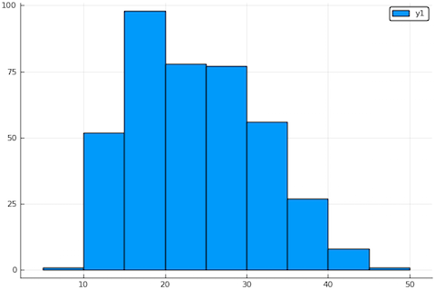

### Load libraries and get data
       
````julia
julia> using Koala   # Author's stats/ML environment
julia> using KoalaTransforms
julia> import KoalaTransforms.normality
julia> using DataFrames
julia> using CSV
julia> using StatsBase
julia> using HypothesisTests
julia> using Plots
julia> using StatPlots
julia> pyplot() # use python plotting backend
Plots.PyPlotBackend()

julia> cars = CSV.read("data/cars_data.csv");
````

### Initial look at data
       
Dump irrelevant features:

````julia
julia> cars = cars[[:am, :mpg]];
julia> head(cars)
6×2 DataFrames.DataFrame
│ Row │ am │ mpg  │
├─────┼────┼──────┤
│ 1   │ 1  │ 21.0 │
│ 2   │ 1  │ 21.0 │
│ 3   │ 1  │ 22.8 │
│ 4   │ 0  │ 21.4 │
│ 5   │ 0  │ 18.7 │
│ 6   │ 0  │ 18.1 │
````

Check for missing data:

````julia
julia> showcols(cars)
32×2 DataFrames.DataFrame
│ Col # │ Name │ Eltype  │ Missing │ Values        │
├───────┼──────┼─────────┼─────────┼───────────────┤
│ 1     │ am   │ Int64   │ 0       │ 1  …  1       │
│ 2     │ mpg  │ Float64 │ 0       │ 21.0  …  21.4 │
````

Get sample size:

````julia
julia> size(cars, 1)
32
````

Split our mpg data into manual and automatic:

````julia
julia> manual = cars[cars[:am] .== 0,:mpg];
julia> auto = cars[cars[:am] .== 1,:mpg];
````

Get individual sample sizes:

````
julia> n_manual = length(manual)
19
julia> n_auto = length(auto)
13
````

Gitter line plots of the data:

````julia
julia> plt1=plot(; title = "Fuel efficiency for 32 models of auto",
                ylim=(-0.5, 0.5), yscale=:none,
                xlab = "M.P.G.");
julia> scatter!(manual, 0.01*randn(length(manual)), label="manual", ms=5.0);
julia> scatter!(auto, 0.01*randn(length(auto)), label="auto", ms=5.0)
````


Box plot comparison:

````julia
julia> plt2=plot(; title = "Box plot comparison of fuel efficiency - auto vs manual",
                xscale=:none, ylabel="M.P.G.");
julia> boxplot!(manual, label="manual");
julia> boxplot!(auto, label="auto")
````


Get bootstrap histograms for the median in each case:

````julia
julia> plt3 = plot(; xlab="M. P. G.",
          title="Bootstrap histograms of the median M.P.G.")
julia> bootstrap_histogram_of_median!(manual, label="manual");
julia> bootstrap_histogram_of_median!(auto, label="automatic";)
````


### Bootstrap confidence intervals
       
Construct bootstrap simulation of difference of medians:

````julia
julia> α = 0.95; # for 95% conf int
julia> n_simulations = 100000;
julia> point_estimate = median(auto) - median(manual)
5.5
julia> simulated_differences = Float64[];
julia> for i in 1:n_simulations
           mpg_manual = sample(manual, n_manual, replace=true)
           mpg_auto = sample(auto, n_auto, replace=true)
           append!(simulated_differences,  median(mpg_auto) - median(mpg_manual))
       end
````

Calculate the pivotal confidence interval:

````julia
julia> left_pvt =  2*point_estimate - quantile(simulated_differences, 1 - α/2)
4.599999999999998
julia> right_pvt = 2*point_estimate - quantile(simulated_differences, α/2)
5.100000000000001
````

Calculate percentile confidence interval:

````julia
julia> left_per = quantile(simulated_differences, α/2)
5.899999999999999
julia> right_per = quantile(simulated_differences, 1 - α/2)
6.400000000000002
````

### T-Test

We now test the null-hypothesis that the median mpg for manual cars
and automatic cars are the same.
       
For the purposes of determining an appropriate transformation of the
data, load a bigger external data set of car fuel efficiency from
[github.com/RodolfoViana/exploratory-data-analysis-dataset-cars](https://github.com/RodolfoViana/exploratory-data-analysis-dataset-cars):

````julia
julia> multi = CSV.read("external/cars_multi.csv", rows_for_type_detect=1000,
         categorical=false, weakrefstrings=false);
julia> mpg_big = multi[:mpg];
julia> length(mpg_big)
398
````

How normal is the data to begin with?

````julia
julia> plt4 = histogram(mpg_big, bins=15)
````


````julia
julia> normality(mpg_big)
0.9851172529342157
````

Does log transform improve normality?

````julia
julia> normality(log.(mpg_big))
0.9922371064148929
````

Yes. Probably, overkill, but let's seek a Box-Cox transformation with
optimal exponent:

````julia
julia> boxcox = UnivariateBoxCoxTransformer();
julia> boxcoxM = Machine(boxcox, mpg_big)
julia> boxcoxM.scheme # the Box-Cox parameters
(0.22, 0.0)
````

So the optimal transformation (encoded in `boxcoxM`) is 

$$ x \mapsto \frac{x^{0.22} - 1}{0.22} .$$

Now let us transform and retest for normality:

````julia
julia> mpg_big2 = transform(boxcoxM, mpg_big);
julia> normality(mpg_big2)
0.9929144158365718
````

Transform the supplied data sets:

````julia
julia> manual2 = transform(boxcoxM, manual);
julia> auto2 = transform(boxcoxM, auto);
````

Compute the p-value for two-sample Welch's t-test:

````julia
julia> test = UnequalVarianceTTest(manual2, auto2)
Two sample t-test (unequal variance)
------------------------------------
Population details:
    parameter of interest:   Mean difference
    value under h_0:         0
    point estimate:          -0.6727333436034479
    95% confidence interval: (-1.036726607345714, -0.30874007986118196)

Test summary:
    outcome with 95% confidence: reject h_0
    two-sided p-value:           0.0008871320584807234

Details:
    number of observations:   [19,13]
    t-statistic:              -3.82771306990251
    degrees of freedom:       22.530387976010406
    empirical standard error: 0.17575333660539558

julia> pvalue(test)
0.0008871320584807234
````
Or, about 1 in 1000. 


